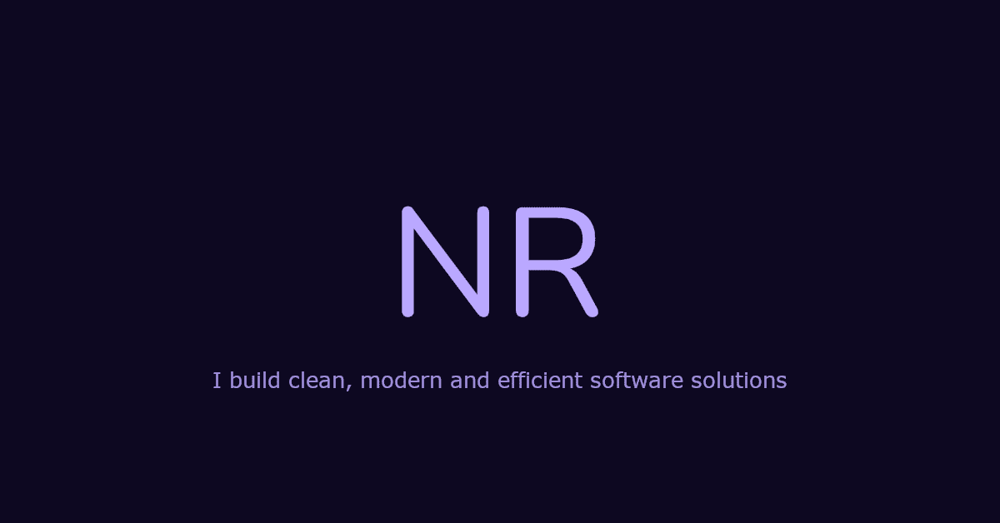

# Portfolio Website - Nelson Rojas <a href="https://nelsonrojas.dev">🔗</a>

Welcome to my personal portfolio website! This project showcases my journey, skills, and selected projects as a frontend web developer. Here, you'll find a brief introduction about me, my interests, and the work I've done over the years to hone my skills.

## About Me 👋
Hi, I'm Nelson Rojas, a Frontend Web Developer with a passion for creating digital solutions. I'm known for my outgoing, fun, and friendly personality, and I strive to bring creativity and technical expertise to every project I work on.

## Sections
- Home: A brief introduction about me and my professional background.
- About: My journey, from my first laptop in 5th grade to becoming a web developer.
- Projects: Highlights of the projects I've completed, showcasing the skills I've developed.
- Contact: Ways to get in touch with me for potential collaborations or job opportunities.